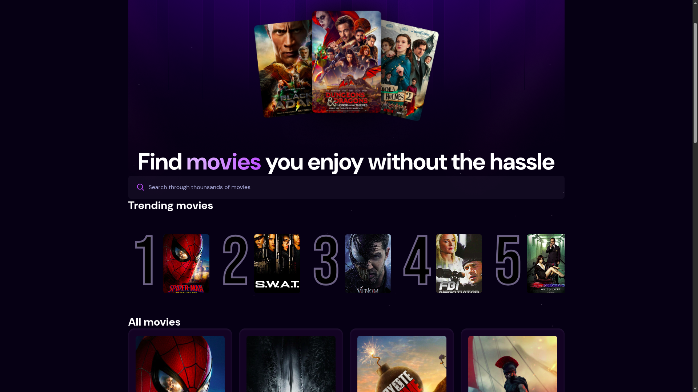
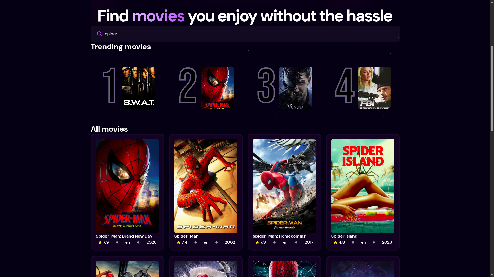
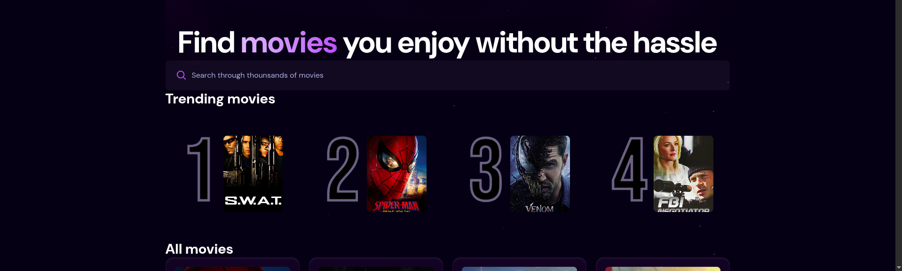
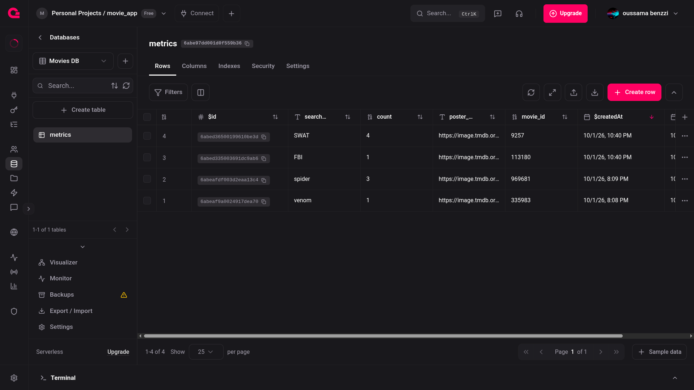

# Movie App

A movie discovery web app built with **React 19 + Vite + Tailwind CSS v4**. It
pulls movies from **The Movie Database (TMDB)** and tracks the most searched
movies in an with a backend as a service **Appwrite relational database (TablesDB)**.

## Screenshots

### Home / Discover



### Searching movies



### Trending movies



### Appwrite `metric` table



### TMDB API usage


## Tech stack

| Layer      | Choice                                   |
| ---------- | ---------------------------------------- |
| UI         | React 19, Tailwind CSS v4                |
| Build tool | Vite 8                                   |
| Data       | TMDB REST API                            |
| Backend    | Appwrite TablesDB (relational database)  |
| Utilities  | `react-use` (`useDebounce`)              |

## Interesting things built

### Debounced search (no request spam)

Typing in the search box does **not** fire a request on every keystroke. The
input updates instantly, but the value used to fetch movies is debounced by
**750 ms** with `useDebounce` from `react-use`:

```js
const [debounceSearchTerm, useDebounceSearchTerm] = useState("");

useDebounce(() => useDebounceSearchTerm(searchTerm), 750, [searchTerm]);
```

The `useEffect` then depends only on `debounceSearchTerm`, so the TMDB API is
hit once the user pauses typing. See `src/App.jsx:29`.

### One code path for discover and search

The same `fetchMovies` function handles both the default "popular movies" feed
and text searches by switching the endpoint:

```js
const endpoint = query
  ? `${API_BASE_URL}/search/movie?query=${encodeURIComponent(query)}`
  : `${API_BASE_URL}/discover/movie?sort_by=popularity.desc`;
```

### Search-count tracking (upsert logic)

Every successful search increments a counter for that query in Appwrite. The
`updateSearchCount` helper implements an upsert by hand: it looks for an
existing row, bumps `count` if found, otherwise creates a new row.

```js
const result = await tablesDB.listRows({
  databaseId: DATABASE_ID,
  tableId: TABLE_ID,
  queries: [Query.equal("searchTerm", searchTerm)],
});

if (result.rows.length > 0) {
  await tablesDB.updateRow({ /* count: row.count + 1 */ });
} else {
  await tablesDB.createRow({ /* searchTerm, count: 1, ... */ });
}
```

### Trending movies from real usage

The app derives a "Trending" section from the actual search history stored in
Appwrite — the top 5 search terms ordered by count.

```js
queries: [Query.limit(5), Query.orderDesc("count")];
```

## Project structure

```
src/
  components/
    MovieCard.jsx   # movie poster + metadata
    search.jsx      # controlled search input
    spiner.jsx      # loading spinner
  lib/
    appwrite.js     # Appwrite client, search count, trending
  App.jsx           # data fetching + page layout
  main.jsx          # app entry
screenshots/        # <-- add your screenshots here
```

## Environment variables

Create a `.env.local` file in the project root:

```bash
VITE_TMDB_API_KEY=your_tmdb_api_key
VITE_TMDB_ACCESS_TOKEN=your_tmdb_read_access_token

VITE_APPWRITE_ENDPOINT=https://fra.cloud.appwrite.io/v1
VITE_APPWRITE_PROJECT_ID=your_project_id
VITE_APPWRITE_DB_ID=your_database_id
VITE_APPWRITE_TABLE_ID=your_table_id
```

## Getting started

```bash
npm install
npm run dev      
npm run build    
npm run lint     
```

## Appwrite table schema (`metric`)

| Column       | Type    | Notes            |
| ------------ | ------- | ---------------- |
| `searchTerm` | varchar | required, 1000   |
| `count`      | integer | default 1        |
| `movie_id`   | integer | required         |
| `poster_url` | url     | required         |

